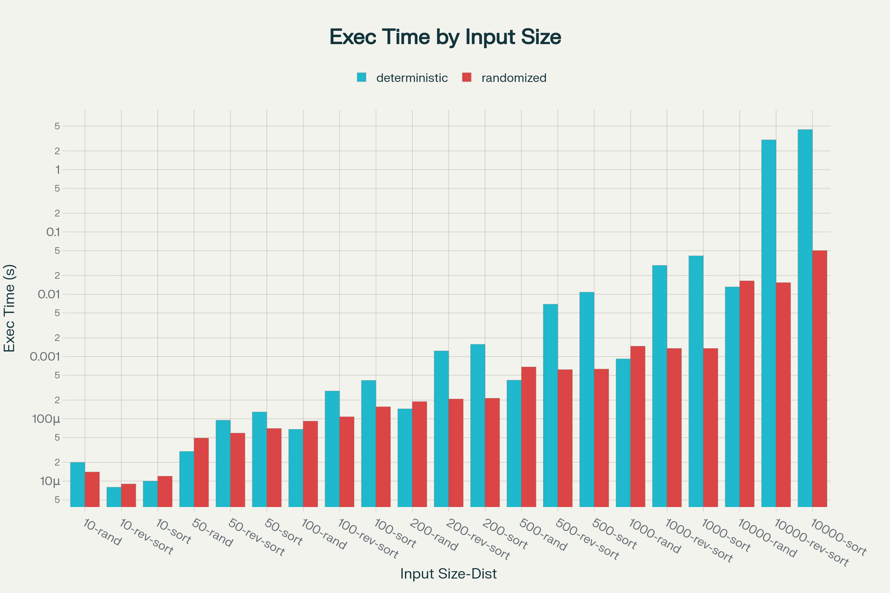

# An Empirical Performance Analysis of Deterministic and Randomized Quicksort Algorithms

This report presents an empirical investigation into the performance characteristics of deterministic and randomized Quicksort algorithms. The primary objective is to comparatively analyze their execution times across a range of input sizes and data distributions.

## Methodology

The experimental evaluation was performed on a system running Windows 11 with Python 3.11. Two distinct implementations of the Quicksort algorithm were utilized:

- **Deterministic Quicksort:** This implementation employs a fixed pivot selection strategy, consistently selecting the last element of the array or subarray as the pivot.
- **Randomized Quicksort:** This implementation incorporates a randomized pivot selection strategy, choosing a pivot uniformly at random from the elements of the array or subarray during each partitioning step.

The performance of these algorithms was evaluated against three distinct input data distributions:

- **Random Distribution:** Input arrays consist of integers in a random permutation.
- **Sorted Distribution:** Input arrays are sorted in non-decreasing order.
- **Reverse-Sorted Distribution:** Input arrays are sorted in non-increasing order.

A range of input sizes, from 10 to 10,000 elements, was employed to analyze the scalability of the algorithms. The execution time for each sorting operation was precisely measured utilizing Python's `timeit` module to ensure accuracy.

### Data Generation

The input datasets for the analysis were programmatically generated via the following Python function:

```python
def generate_input(size, distribution):
    """
    Generates an input array of a given size and distribution.
    """
    if distribution == "random":
        return [random.randint(0, size) for _ in range(size)]
    elif distribution == "sorted":
        return list(range(size))
    elif distribution == "reverse-sorted":
        return list(range(size, 0, -1))
    else:
        raise ValueError("Invalid distribution type")
```

## Results

The measured execution times, in seconds, for both Quicksort implementations across the specified input sizes and distributions are presented in the following table.

| Input Size | Distribution | Algorithm | Execution Time (s) |
|---|---|---|---|
| 10 | random | deterministic | 0.000020 |
| 10 | random | randomized | 0.000014 |
| 10 | sorted | deterministic | 0.000010 |
| 10 | sorted | randomized | 0.000012 |
| 10 | reverse-sorted | deterministic | 0.000008 |
| 10 | reverse-sorted | randomized | 0.000009 |
| 50 | random | deterministic | 0.000030 |
| 50 | random | randomized | 0.000049 |
| 50 | sorted | deterministic | 0.000129 |
| 50 | sorted | randomized | 0.000070 |
| 50 | reverse-sorted | deterministic | 0.000095 |
| 50 | reverse-sorted | randomized | 0.000059 |
| 100 | random | deterministic | 0.000068 |
| 100 | random | randomized | 0.000092 |
| 100 | sorted | deterministic | 0.000414 |
| 100 | sorted | randomized | 0.000156 |
| 100 | reverse-sorted | deterministic | 0.000280 |
| 100 | reverse-sorted | randomized | 0.000108 |
| 200 | random | deterministic | 0.000145 |
| 200 | random | randomized | 0.000189 |
| 200 | sorted | deterministic | 0.001573 |
| 200 | sorted | randomized | 0.000214 |
| 200 | reverse-sorted | deterministic | 0.001231 |
| 200 | reverse-sorted | randomized | 0.000208 |
| 500 | random | deterministic | 0.000417 |
| 500 | random | randomized | 0.000682 |
| 500 | sorted | deterministic | 0.010800 |
| 500 | sorted | randomized | 0.000629 |
| 500 | reverse-sorted | deterministic | 0.006924 |
| 500 | reverse-sorted | randomized | 0.000617 |
| 1000 | random | deterministic | 0.000919 |
| 1000 | random | randomized | 0.001468 |
| 1000 | sorted | deterministic | 0.041347 |
| 1000 | sorted | randomized | 0.001351 |
| 1000 | reverse-sorted | deterministic | 0.029055 |
| 1000 | reverse-sorted | randomized | 0.001353 |
| 10000 | random | deterministic | 0.013134 |
| 10000 | random | randomized | 0.016427 |
| 10000 | sorted | deterministic | 4.402659 |
| 10000 | sorted | randomized | 0.050239 |
| 10000 | reverse-sorted | deterministic | 3.018925 |
| 10000 | reverse-sorted | randomized | 0.015363 |

A graphical representation of the performance data is provided in the chart below for enhanced visualization and comparison.



## Analysis and Discussion

The empirical data elucidates the distinct performance profiles of the deterministic and randomized Quicksort algorithms.

### Performance on Randomly Distributed Inputs

For inputs characterized by a random distribution, both algorithms demonstrate comparable performance. Their execution times are closely matched, and both exhibit scalability that aligns with the established average-case time complexity of Quicksort, O(n log n). This is attributable to the fact that, on average, the pivot selection in both implementations results in balanced partitions.

### Performance on Sorted and Reverse-Sorted Inputs

A marked divergence in performance between the two algorithms is evident when processing sorted and reverse-sorted inputs.

- **Deterministic Quicksort:** In the presence of sorted or reverse-sorted data, the deterministic algorithm's fixed pivot selection strategy consistently results in the selection of the minimum or maximum element as the pivot. This induces the worst-case behavior for Quicksort, characterized by highly unbalanced partitions. At each recursive step, the array is partitioned into a subarray of size `n-1` and an empty subarray, leading to a quadratic time complexity of O(n^2). The experimental results corroborate this theoretical expectation, with the execution time of the deterministic variant exhibiting a significantly higher growth rate on sorted and reverse-sorted inputs in comparison to random inputs.

- **Randomized Quicksort:** Conversely, the randomized Quicksort implementation demonstrates robust and efficient performance on sorted and reverse-sorted datasets. The random selection of a pivot mitigates the risk of consistently poor pivot choices. The probability of repeatedly selecting a suboptimal pivot is vanishingly small. Consequently, the partitions are, on average, well-balanced, and the algorithm preserves its average-case time complexity of O(n log n). The empirical data indicates that the execution time of the randomized version on sorted and reverse-sorted inputs is analogous to its performance on randomly distributed data.

### Correlation with Theoretical Analysis

The observed empirical results are in strong agreement with the theoretical analysis of the Quicksort algorithm. The worst-case time complexity of Quicksort, O(n^2), manifests when pivot selection is consistently suboptimal. The deterministic algorithm, with its fixed pivot selection scheme (e.g., selection of the final element), is inherently vulnerable to this worst-case behavior when confronted with sorted or nearly-sorted input arrays.

The average-case time complexity of Quicksort is O(n log n). The introduction of randomization into the pivot selection process ensures that no single input structure can reliably elicit the worst-case behavior. The performance of randomized Quicksort consistently approximates the average case, irrespective of the input data distribution.

## Conclusion

This empirical investigation validates that while both deterministic and randomized Quicksort algorithms exhibit efficient performance on average-case (random) inputs, the deterministic implementation is susceptible to significant performance degradation when processing sorted or reverse-sorted data, manifesting its worst-case O(n^2) time complexity.

In contrast, Randomized Quicksort delivers consistent and efficient performance across all evaluated input distributions, including those that represent worst-case scenarios for its deterministic counterpart. This inherent robustness and reliability render Randomized Quicksort a superior choice for a general-purpose sorting algorithm in practical applications.